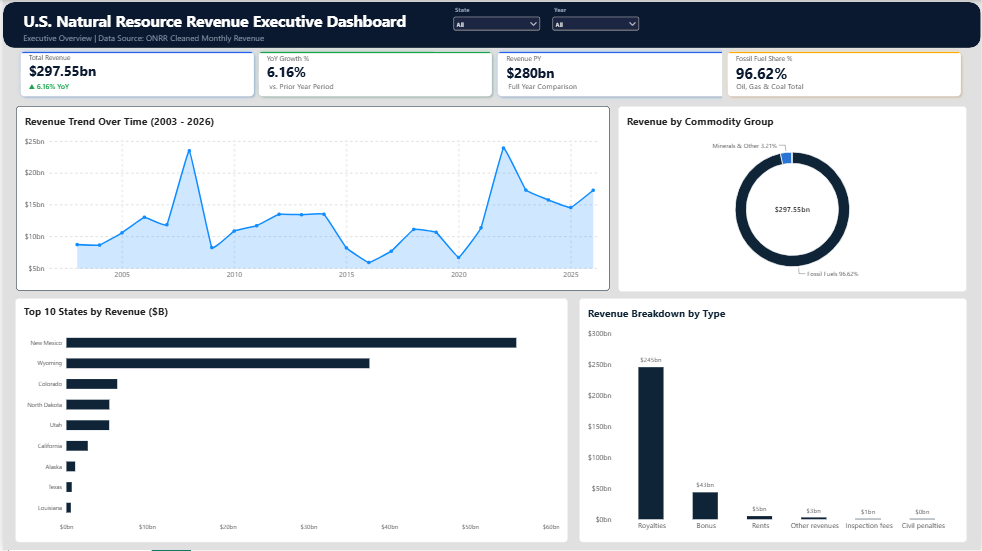

# U.S. Natural Resource Revenue Dashboard

An executive Power BI dashboard and Python ETL pipeline analyzing monthly U.S. natural resource revenues (2003–2026) from oil, gas, coal, and minerals across states and lease types.



---

## 📌 Project Overview

This project processes public revenue data to deliver actionable insights into national energy revenues, fossil fuel dependency, top revenue-generating states, and payment types (royalties, bonuses, and rents).

### Key Highlights
- **Total Revenue:** **$297.55B**
- **YoY Revenue Growth:** **+6.16%**
- **Fossil Fuel Share:** **96.62%** (Oil, Gas, and Coal)
- **Top State:** **New Mexico** (**$55.7B+**)

---

## 🎯 What Was Achieved

* **Automated Data Pipeline:** Built a Python script to clean, transform, and structure unorganized raw revenue records for analysis.
* **Data Modeling:** Designed a relational data model with custom DAX measures for period-over-period financial tracking.
* **Executive Visualization:** Created an interactive Power BI dashboard designed for quick decision-making, tracking state-level contributions, revenue streams, and commodity distributions.

---

## 📂 Project Structure
```text
us-natural-resource-revenue-dashboard/
│
├── data/
│   ├── raw_monthly_revenue.csv          # Original source data
│   └── cleaned_monthly_revenue.zip      # Cleaned dataset (ZIP archive)
│
├── scripts/
│   └── data_cleaning_pipeline.py        # Python ETL & data cleaning script
│
├── reports/
│   ├── US_Natural_Resource_Revenue_Dashboard.pbix   # Power BI dashboard file
│   └── dashboard_preview.png             # Dashboard screenshot
│
└── README.md                             # Project documentation

```
---
## 🛠️ Tech Stack & Tools
Data Cleaning & ETL: Python (pandas)

Business Intelligence: Power BI Desktop, DAX, Power Query

Version Control & Hosting: GitHub
---

## 🚀 How to View & Use

Dataset: Extract data/cleaned_monthly_revenue.zip to access the processed dataset.
Dashboard: Open reports/US_Natural_Resource_Revenue_Dashboard.pbix in Power BI Desktop to interact with the full dashboard.

---
## 👨‍💻 Author & Contact
Dogo Paul Olamilekan

LinkedIn: linkedin.com/in/dogo-paul-02b692367

Email: dogopaul2007@gmail.com
